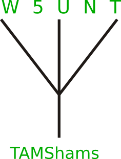

This is the website of TAMShams, the amateur radio club of the
[Texas Academy of Mathematics and Science](http://tams.unt.edu/).

Our purpose is to promote interest and participation in amateur radio at TAMS and to do cool stuff on the air.

Meetings during the 2013–2014 school year will be held every Wendesday at 7:00 PM in the W5UNT station unless otherwise announced.
Current information about club activities and events for the 2012–2013 school year can be found at 
[our Facebook group](https://www.facebook.com/groups/tamshams2012/).
If you would like to join the club, please join our Facebook group.

We will QSL direct and via the buro, eQSL, and LoTW.
Feel free to use any and all of those methods.

We are currently trying for the Worked All States (WAS) award.
You can see the list of states we have and haven't contacted at [this page](http://w5unt.com/was.html).
If you're in one of the states we're missing, of if you just want to chat, we would really appreciate a sked.
To arrange skeds, please email kf5soq@arrl.net .
